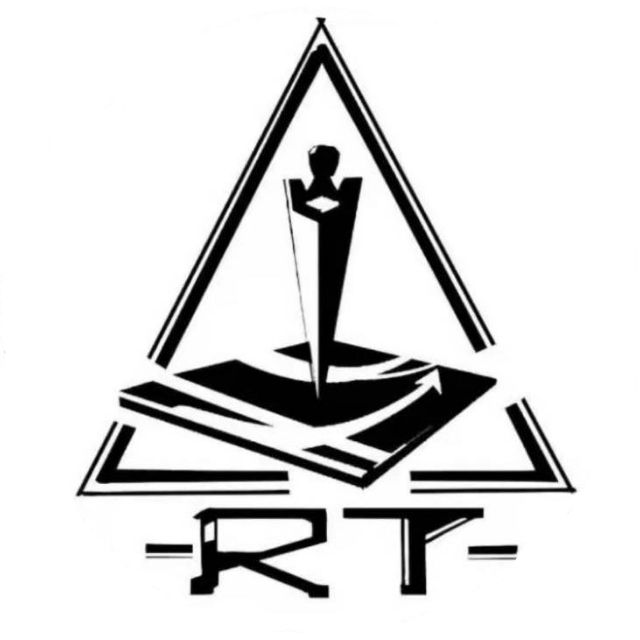

# RT战队官网

## 简介
创建于2010年5月，RT战队是红色警戒尤里的复仇战队，专注于尤里的复仇在全国红色警戒范围内的推广，是国内尤里的复仇最早期的战队之一。时至今日，RT战队已经发展成为国内人数最多的尤里复仇战队，很多其奠定的战术和传统至今仍被沿用。我们专注于战队的发展和新人的培养，所以，如果你热爱红色警戒热爱尤里的复仇，欢迎加入RT战队。

| [队史](history.md)     | [RT档案馆](archive.md) | [精选文章](article.md) | [资料库](resource.md) |[故事墙](wall.md) |

| [队史](history.md)   | [RT档案馆](archive.md) | [精选文章](article.md)  | [资料库](resource.md) |[故事墙](wall.md) |
| ------------- | ------------- |------------- | ------------- | ------------- |

## QQ群号：653488793